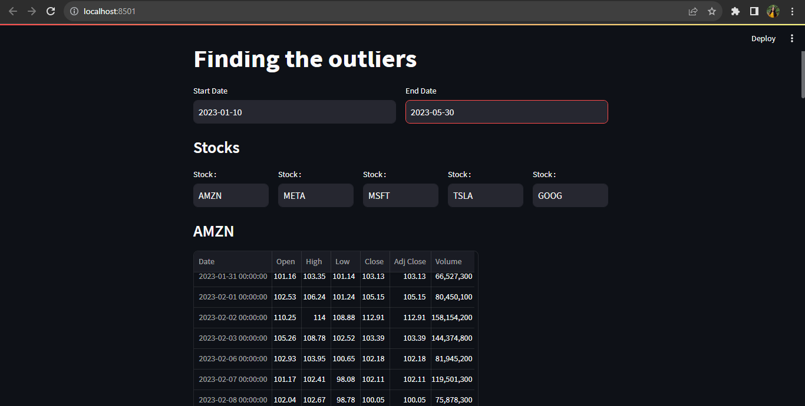
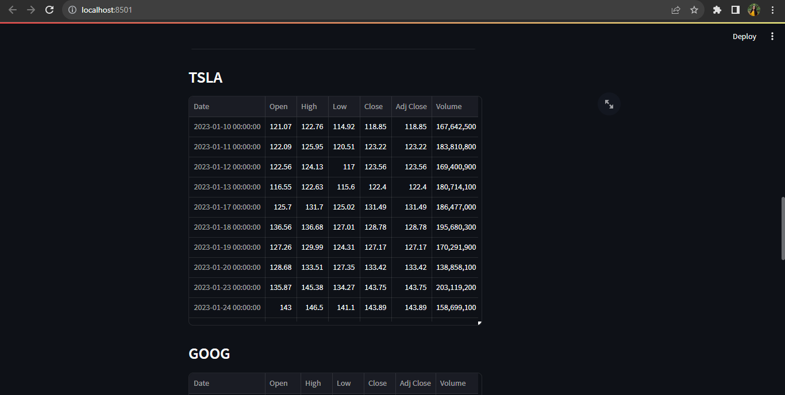
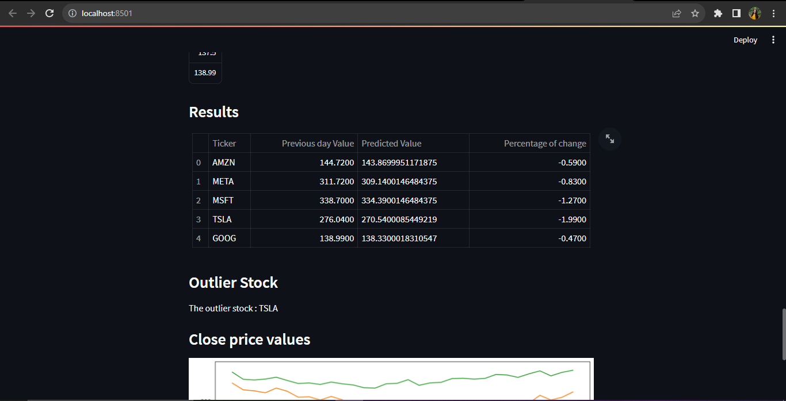
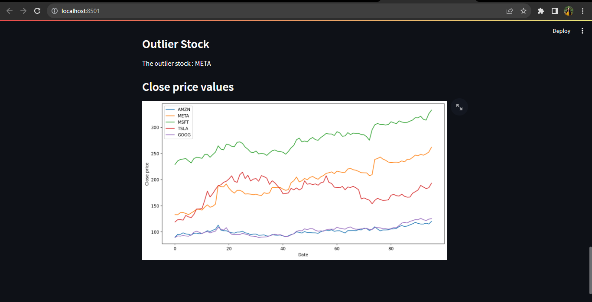
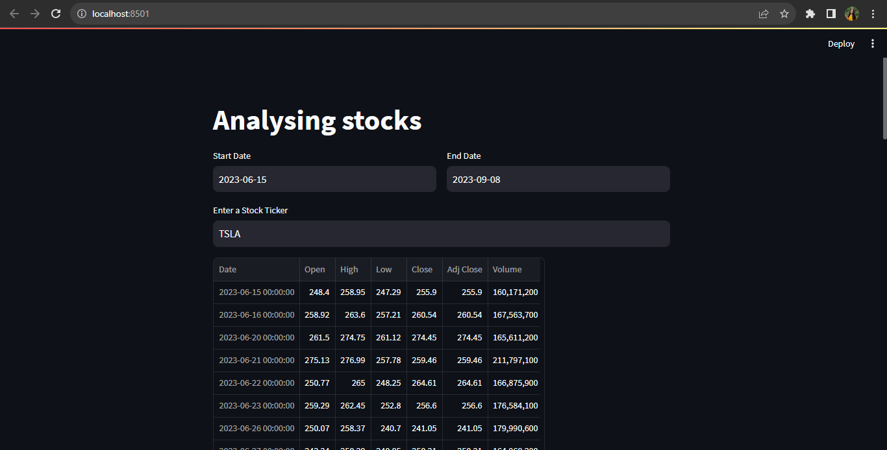
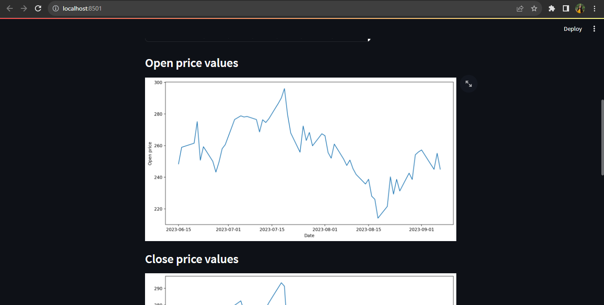
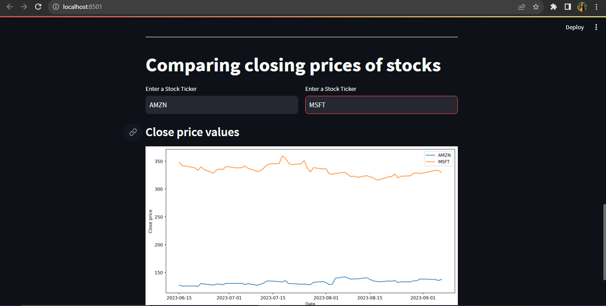

[comment]: # "This is the standard layout for the project, but you can clean this and use your own template"

# Finding the Outliers - Stock Charts

---

## Team
-  E/18/323, Seekkubadu H.D. [e18323@eng.pdn.ac.lk](mailto:e18323@eng.pdn.ac.lk)
-  E/18/330, Sewwandi H.R. [e18330@eng.pdn.ac.lk](mailto:e18330@eng.pdn.ac.lk)
-  E/18/375, Vindula K.P.A. [e18375@eng.pdn.ac.lk](mailto:e18375@eng.pdn.ac.lk)

## Table of Contents
1. [Introduction](#introduction)
2. [Solution](#other-sub-topics)
3. [Links](#links)

---

## Introduction

The stock market, also known as the equity market, is a platform where publicly traded companies issue and sell shares of their stock to the public. It is a market where investors can buy, sell, and trade shares of stock, which represent ownership in a company.

Most of stocks during the same trading session are moving almost in the same pattern.
Next chart is showing how active 30 stocks are changing during the 390 minutes of trading session.

By identifying outliers in a trading session, the trader will be able to make a large sum of profit by exploiting the large difference in buying and selling price.

## Problem Domain

Basically, in here We are going to predict the outliers in the stock market.  We all know on the given day that 100 stocks are being exchanged in a single moment. So how can we know at the start of the day which stocks will have the largest gain and which stocks will have the biggest losses. 

In here what we want to do is, we should predict as early as possible which stocks will have the largest deviation from the previous days' values. So, then we can identify what the outlier stocks are.

But normally it is very hard to say about that,  
that is why we take the previous history values and trained a model to do the prediction.

## Solution

we come up with the model that can predict at the start of the training day its end value. So basically at the start of the training day our model will predict the end value.  
Then by looking at the predicted values of our model we can evaluate which stock will have the largest gain, largest percentage gain. Based on that we can trade.  

## Machine Learning Approach

We selected **LSTM** as our algorithm. Since we are dealing with the sequencial data, this algorithm will help to model with high accuracy. Based on the past three months values we selected Closed Prize value and build our model to predict the end value of the next day at the start of that day. 

## Data Visualization - Dashboard

### Finding the outliers

### Analysing stocks

## Links

- [Project Repository](https://github.com/cepdnaclk/e18-6sp-Finding-the-Outliers-Group20/)
- [Project Page](https://cepdnaclk.github.io/e18-6sp-Finding-the-Outliers-Group20/)
- [Department of Computer Engineering](http://www.ce.pdn.ac.lk/)
- [University of Peradeniya](https://eng.pdn.ac.lk/)

[//]: # (Please refer this to learn more about Markdown syntax)
[//]: # (https://github.com/adam-p/markdown-here/wiki/Markdown-Cheatsheet)
