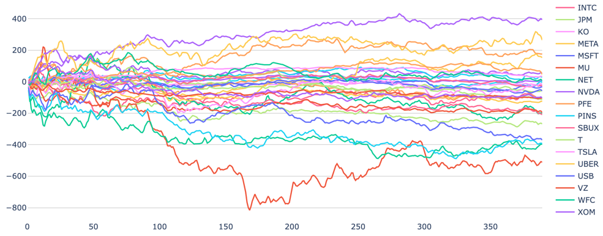
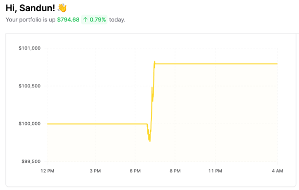

[comment]: # "This is the standard layout for the project, but you can clean this and use your own template"

# Finding the Outliers - Stock Charts

---

## Team
-  E/18/323, Seekkubadu H.D. [e18323@eng.pdn.ac.lk](mailto:e18323@eng.pdn.ac.lk)
-  E/18/330, Sewwandi H.R. [e18330@eng.pdn.ac.lk](mailto:e18330@eng.pdn.ac.lk)
-  E/18/375, Vindula K.P.A. [e18375@eng.pdn.ac.lk](mailto:e18375@eng.pdn.ac.lk)

## Table of Contents
1. [Introduction](#introduction)
2. [Solution](#other-sub-topics)
3. [Links](#links)

---

## Introduction

Most of stocks during the same trading session are moving almost in the same pattern.
Next chart is showing how active 30 stocks are chaing during the 390 minutes of trading session.

By finding a methodology to identify which stock will not follow the crowd, that outlier will return exceptional profit as below.

## Other Sub Topics

.....

## Links

- [Project Repository](https://github.com/cepdnaclk/e18-6sp-Finding-the-Outliers-Group20/)
- [Project Page](https://cepdnaclk.github.io/e18-6sp-Finding-the-Outliers-Group20/)
- [Department of Computer Engineering](http://www.ce.pdn.ac.lk/)
- [University of Peradeniya](https://eng.pdn.ac.lk/)

[//]: # (Please refer this to learn more about Markdown syntax)
[//]: # (https://github.com/adam-p/markdown-here/wiki/Markdown-Cheatsheet)
